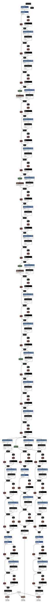

# 3D Face Landmark in UnityCG HLSL

### NOTE: This was built and tested with Unity 2018.4.20f1, there may be shader compatibility issues with other versions.

## Table of Contents
- [Overview](#overview)
- [Problems](#problems)
- [Implementation Details](#implementation-details)
    - [Facemesh Shader](#facemesh-shader-outputs)
    - [Iris Shader](#iris-shader-outputs)
    - [Blendshape Values](#blendshape-values-calculations)
- [Setup](#setup)
- [Facemesh Architecture](#facemesh-architecture)
- [Iris Architecture](#iris-architecture)
- [Resources](#resources)

## Overview
Face landmark detection using two MediaPipe models: Facemesh and Iris, implemented inside Unity using over 120 Custom Render Textures.

Designed for mobile platforms, the two networks are perfect for use in VR. Both networks are capped at 60 FPS in this implementation but can be modified to run faster.

***Figure 1. Facemesh Outputs***

The original Facemesh model has three main outputs: face flag, 468 3D face points, and 133 2D contour points (edge points of face, eyes, mouth). My implementation of Facemesh throws out the 133 2D contour outputs to save computation time since I won't be using those.

To retrieve the head rotations, I use SVD (singular value decomposition) on three points outputted from Facemesh to get the rotation matrix. The eye positions are also used to feed into the Iris tracking model.

***Figure 2. Iris Outputs***

The Iris model has two outputs, same as the original, 71 3D brows and contour points and 5 3D iris points.

At the final step, a shader takes Facemesh and Iris model outputs, calculates blendshape values based on key points and smooths the results.

## Problems
- No face detection, meaning the user must have their face within the center of the input camera.
- SVD (singular value decomposition) not accurate, there isn't any SVD libraries written for HLSL. The only one I found was UnitySVDComputeShader and it only solves 3x3 matrices, meaning I can only use 3 points from Facemesh to solve the rotation.
- Slow implementation, it's only fast cause it's made for mobile devices.
- Iris tracking also requires the eyes to be in the very center. Without a good SVD method, it's harder to undo rotations and translations for the eyes accurately.

## Implementation Details

### Facemesh Shader Outputs
Location: .../FaceLandmarkDetection/CRTs/FaceMesh
* **CRT: L20**
    * Format: R Float
    * Size: 39 x 36
    * 13 XYZ points per row, 36 rows, 468 points total
    * These are the unmodified outputs of the 3D Facemesh points
* **CRT: L20_RR**
    * Format: ARGB Float
    * Size: 13 x 36
    * XYZ stored in RGB, 13 per row, 36 rows, 468 total
    * RR stands for reversed rotation, this CRT attempts to undo the head rotations for more accurate measurements during blend shape calculations
* **CRT: L24**
    * Format: R Float
    * Size: 1 x 1
    * Face flag output, 1 is face, 0 is not a face
* **CRT: Procrustes Analysis**
    * Format: ARGB Float
    * Size: 8 x 8
    * This shader calculates the rotations of the head using SVD
    * Row 0 stores the variables, Rows 1 - 7 saves the last frame for smoothing calculations

Name | Location (X, Y)
-----|---------
Rotation Matrix Top | 0, 0
Rotation Matrix Middle | 1, 0
Rotation Matrix Bottom | 2, 0
Scale and Frobenius norm | 3, 0
Target Centroid | 4, 0
Source Centroid | 5, 0

    
    

### Iris Shader Outputs
Location: .../FaceLandmarkDetection/CRTs/Iris

*One iris network is used for both eyes. To keep track of which output is left or right, each layer of the network adds a 10000000.0 to output location (0, 0) if it's the right eye.*

* **CRT: iris_L57**
    * Format: R Float
    * Size: 3 x 71
    * The unmodified outputs of the 3D brow and contour points
    * Each row contains the XYZ position, 71 points total
* **CRT: iris_L82**
    * Format: R Float
    * Size: 3 x 5
    * Unmodified outputs of the 5 iris tracking points
    * Each row contains XYZ position, row 0 is iris center, the other 4 are the surrounding points
* **CRT: LR_Brows**
    * Format: ARGB Float
    * Size: 8 x 18
    * Stores the outputs based on whether it's the right or left eye. XYZ position stored in RGB
    * Bottom 4 x 18 contains brows/contour points for the **right eye**
    * Top 4 x 18 contains brows/contour points for the **left eye**
* **CRT: LR_Eyes**
    * Format: ARGB Float
    * Size: 2 x 5
    * XYZ position stored in RGB
    * Column 0 contains iris points for **right eye**
    * Column 1 contains iris points for **left eye**

### Blendshape Values Calculations
Location: .../FaceLandmarkDetection/CRTs/

* **CRT: BlendValues**
    * Format: ARGB Float
    * Size: 8 x 8
    * Calculates the blendshape values based on the distance between key points. Ex. mouth open/close values are calculated between the distance of the top and bottom lip points
    * Outputs are unclamped values scaled between 0.0 to 1.0
    * Row 0 stores the variables, Rows 1 - 7 saves the last frame for smoothing calculations

Name | Location (X, Y)
-----|---------
Rotation Matrix Top | 0, 0
Rotation Matrix Middle | 1, 0
Rotation Matrix Bottom | 2, 0
Mouth open, shrink, smile | 3, 0
Eyes blink left, right | 4, 0
Brow left up/down, right up/down | 5, 0
Iris left XY, right XY position | 6, 0

The rotation matrix is copied over from the Procrustes Analysis CRT.

## Setup

**This is more of a tech demo, not made for actual use. Setting this up correctly is a tedious process for a impractical effect. If you wish to continue, you'll need to know how to edit shaders.**

1. At least two meshes, the face must be a completely separate mesh from the rest of the body. No more than 16384 vertices on the face because the blendshapes are baked onto 128 x 128 textures.

2. Start creating the blendshapes:
    1. blink right
    2. blink left
    3. right brow inner down
    4. right brow outer down
    5. left brow inner down
    6. left brow outer down
    7. right eye looking in
    8. right eye looking out
    9. right eye looking up
    10. right eye looking down
    11. left eye looking in
    12. left eye looking out
    13. left eye looking up
    14. left eye looking down
    15. mouth wide open
    16. mouth shrink
    17. mouth smile
    18. mouth frown

### Facemesh Architecture

### Iris Architecture

## Resources
- [MediaPipe Facemesh](https://tfhub.dev/mediapipe/tfjs-model/facemesh/1/default/1)
- [Keijiro's MediaPipe Iris Implementation](https://github.com/keijiro/IrisBarracuda)
- [Procrustes Analysis](https://stackoverflow.com/questions/18925181/procrustes-analysis-with-numpy)
- [UnitySVDComputeShader](https://github.com/vanish87/UnitySVDComputeShader/blob/master/UnitySVDComputeShader/Assets/Math.cginc)
- [CHARLIZE THERON_HEAD](https://sketchfab.com/3d-models/charlize-theron-head-ca8926f4284045c6a2e75a6f7642c851)